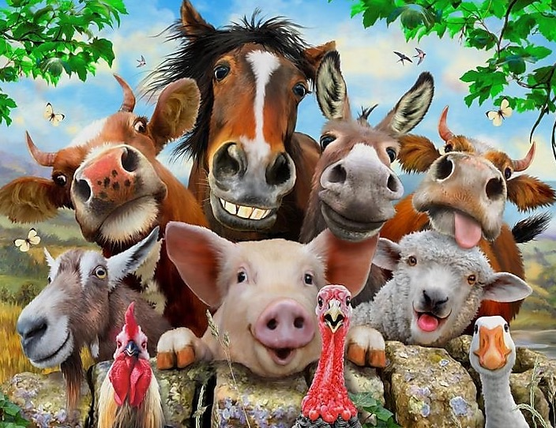

EE205 Animal Farm
=================

Animal Farm is a series of labs intended to teach the basics of C and C++.  It's also intended to introduce good
Software Engineering practices.  Students are expected to "Live" in
this project as the code evolves over a series of requirements.

#### Links
The project's home page (hosted by GitHub) is [here](https://github.com/marknelsonengineer/ee205_lab10d_animal_farm_2)

The documentation for the source code (hosted by UH) is [here](http://www2.hawaii.edu/~marknels/ee205/animalFarm/index.html)

#### Roadmap
| Animal Farm Version | Description                                                                                                                                                                                                                                                                                                                                                                                    |
|---------------------|------------------------------------------------------------------------------------------------------------------------------------------------------------------------------------------------------------------------------------------------------------------------------------------------------------------------------------------------------------------------------------------------|
| Animal Farm 0       | An array-based database of cats, where each attribute is an array.                                                                                                                                                                                                                                                                                                                             |
| Animal Farm 1       | An array-based database of cats, where each a cat's attributes are collected in a `struct`.                                                                                                                                                                                                                                                                                                    |
| Animal Farm 2       | A procedural singly linked-list database of cats, where each cat is an object.                                                                                                                                                                                                                                                                                                                 |
| Animal Farm 3       | A collection class that implements a singly linked database of Animal objects using: <ul><li>An abstract List</li><li>A concrete SinglyLinkedList</li><li>generic Node</li></ul>Add an abstract Animal (which also inherits from Node) & Mammal to the Cat object model.                                                                                                                       |
| Animal Farm 4       | A collection class that implements a doubly linked list.   Add Fish, Bird and Dog to the object model. Build a class factory for Cat.   Add destructors to the object model.  Create a CatLinkedList that inherits from SinglyLinkedList… and then implement findCatByName  Have Cat override > to sort cats by name …think about how we are going to sort our animals |
| Animal Farm 5       | Refactor the collection class into a Binary Search Tree.   Add Birds and Fish to the object model.                                                                                                                                                                                                                                                                                         |
