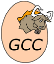
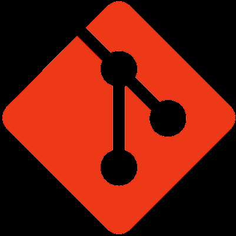
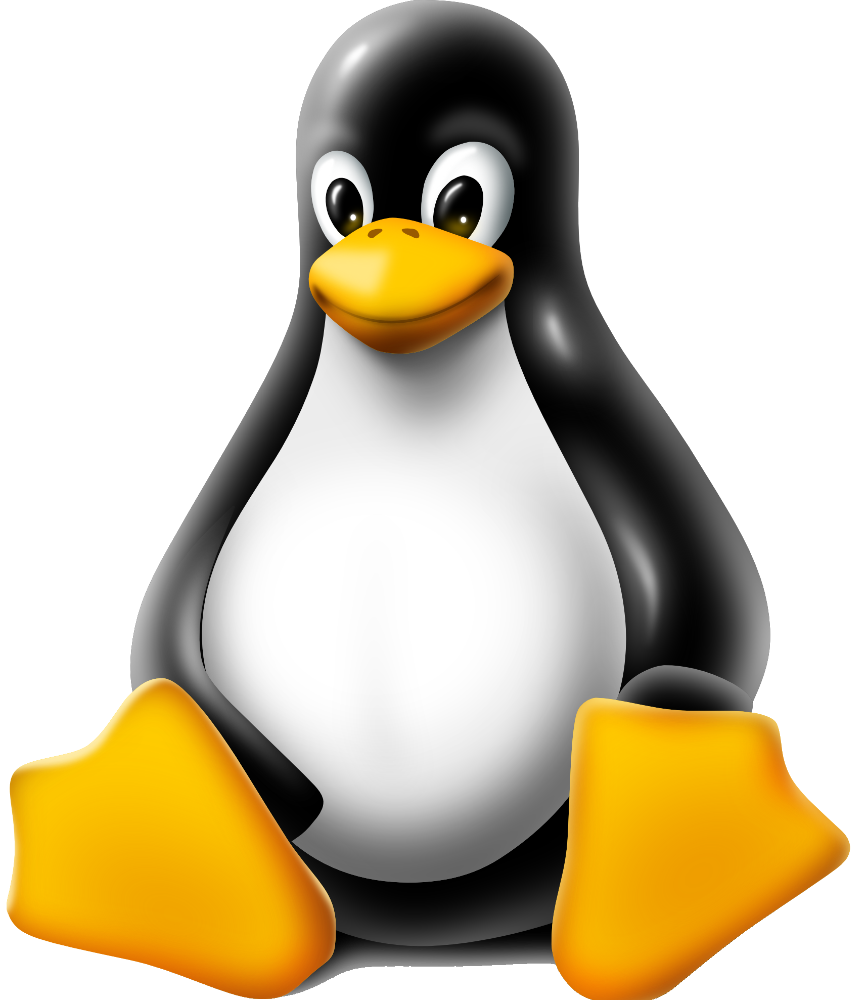

EE205 Animal Farm
=================

Animal Farm is a series of labs intended to teach the basics of C and C++.  It's also intended to introduce good
Software Engineering practices.  Students are expected to "Live" in
this project as the code evolves over a series of requirements.

#### Links
The project's home page (hosted by GitHub) is [here](https://github.com/marknelsonengineer/ee205_animal_farm)

The source code documentation (hosted by UH) is [here](https://www2.hawaii.edu/~marknels/ee205/ee205_animal_farm)

#### Roadmap
| Assignment                     | Description                                                                                          |
|--------------------------------|------------------------------------------------------------------------------------------------------|
| Animal Farm 0                  | Instantiate the Farm in CLion & GitHub.  Write config.h w/ PROGRAM_NAME.  Hello World in `main()`.   |
| Animal Farm 1                  | Bring Doxygen to the Farm                                                                            |
| Animal Farm 2                  | Write our first utility function:  Trim.  Introduce Boost Tests.                                     |
| Animal Farm 3                  | Write our second utility function:  Name.  Get into exceptions.  Start CONTRIBUTE.md                 |
| Animal Farm 4                  | An array-based database of cats, where each attribute is an array.                                   |
| Animal Farm 5                  | An array-based database of cats, where each a cat's attributes are collected in a `struct`.          |
| Cat Lives 1                    | Basic Color & Gender                                                                                 |
| Animal Farm 6                  | A basic cat object                                                                                   |
| Animal Farm 7                  | A better cat object that uses Trim & Name                                                            |
| Animal Farm 8                  | An array-based cat (object) database                                                                 |
| Cat Pride 1                    | Separate the data from the algorithm.  Node & Cat separation using Array-based storage               |
| Animal Farm 9                  | Random & Cat Factory                                                                                 |
| Cat Lives 2                    | Color & Gender w/ `<<` override                                                                      |
| FatCat                         | Weight                                                                                               |
| Animal Farm 10                 | Cat comparators & swap                                                                               |
| Cat Pride 2                    | n2 sorts                                                                                  |
| Animal Farm 11                 | Refactor Node & Linked List                                                                          |
| Cat Navy                       | Cats & Nodes & Linked Lists                                                                          |
| Animal Farm 12                 | Mammal & Animal classes                                                                              |
| Animal Farm 13                 | Dogs & Birds & Finches & Chickens                                                                    |
| Animal Farm 14                 | Animal Generators                                                                                    |
| Animal Farm 15                 | Doubly Linked Lists                                                                                  |
| Cat Wrangler 1                 | Doubly Linked List collections w/ Cats                                                               |
| Cat Wrangler 2                 | Cat (and Node) comparisons                                                                           |
| Cats Waiting Patiently In Line | Queues                                                                                               |
| Cat Wrangler 3                 | Swap                                                                                                 |
| Cat Wrangler 4                 | Port n2 sorts                                                                             |
| Cat Wrangler 5                 | n ln(n) sorts                                                                                        |
| Animal Farm 16                 | Trees                                                                                                |
| Cat Empire! 1                  | Make a Cat-specific Binary Search Tree                                                               |
| Cat Empire! 2                  | Do several traversals of CatEmpire!                                                                  |
| Cat Empire! 3                  | Implement a delete() method on a Binary Search Tree                                                  |
| Optimus Cat                    | Performance analysis of add, remove, n2 sorts and n ln(n) sorts on Arrays, Lists & Trees. |

#### Toolchain
This project is the product of a tremendous amount of R&D and would not be possible without the following world-class tools:

| Tool           | Website                     |                                                Logo                                                 |
|----------------|-----------------------------|:---------------------------------------------------------------------------------------------------:|
| **gcc**        | https://gcc.gnu.org         |      |
| **llvm/clang** | https://clang.llvm.org      |     |
| **CLion**      | https://jetbrains.com/clion |    |
| **CMake**      | https://cmake.org           |    |
| **Doxygen**    | https://doxygen.nl          |  |
| **Boost**      | https://boost.org           |    |
| **Git**        | https://git-scm.com         |      |
| **GitHub**     | https://github.com          |   |
| **GitLab**     | https://gitlab.org          |   |
| **Linux**      | https://kernel.org          |    |
